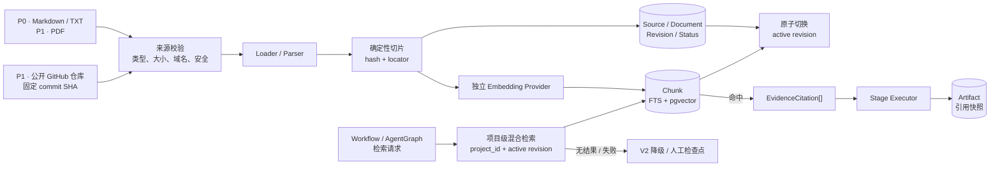
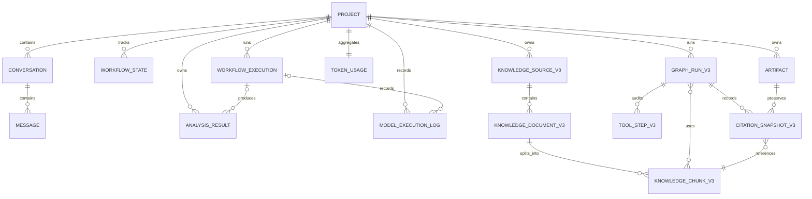

# System Design

> Version: 1.2.0
> Status: Current V2 + Planned V3

---

本文档只作为系统设计入口，不承载具体实现细节，避免与 `architecture-overview.md` 和 `specs/*` 重复。

## 权威来源

完整索引见 [`README.md`](./README.md)。

| 主题                           | 权威文档                                                                                       |
| ------------------------------ | ---------------------------------------------------------------------------------------------- |
| 产品定位、核心目标、MVP 范围   | `docs/product-vision.md`                                                                       |
| 架构全景、技术栈、设计约束     | `docs/architecture-overview.md`                                                                |
| 工作流阶段、状态转换、降级路径 | `specs/workflow.spec.md` + `specs/state-machine.spec.md`                                       |
| 数据库表结构、约束、索引       | `specs/database.spec.md`                                                                       |
| API 摘要与实现约束             | `specs/api.spec.md`                                                                            |
| API 机器可读契约               | `contracts/openapi.yaml`                                                                       |
| 数据实体与 LLM 输出 Schema     | `specs/schema.spec.md` + `contracts/schemas/llm/*.json`                                        |
| LLM Provider 与 Orchestrator   | `specs/provider.spec.md` + `specs/orchestrator.spec.md`                                        |
| 模型路由与 Prompt 管理         | `specs/model-routing.spec.md` + `specs/prompt.spec.md`                                         |
| Web UI                         | `specs/frontend.spec.md`                                                                       |
| V3 项目知识库（Proposed）      | `specs/knowledge-base.spec.md`                                                                 |
| V3 Agent Graph（Proposed）     | `specs/agent-graph.spec.md`                                                                    |
| 开发流程、测试、部署           | `docs/playbooks/development.md` + `docs/playbooks/testing.md` + `docs/playbooks/deployment.md` |

## 开发加载规则

开发 Agent 不应从本文档提取实现细节。按 `docs/README.md` 只加载当前任务相关的 spec、contract 和 playbook。

## 1. 主流程与调用链

实线表示 Current V2，紫色虚线表示 Planned V3。P0/P1/P2 对应 [`v3-rag-agent.md`](./exec-plans/active/v3-rag-agent.md) 的实施优先级。

```mermaid
flowchart LR
  user["用户 / Browser"]

  subgraph api["NestJS API Server"]
    guard["Guard / Pipe<br/>限流、参数校验"]
    controller["Workflow Controller"]
    workflow["Workflow Service<br/>项目校验、成本准入"]
    stages["Stage Executor<br/>9 个阶段 / 4 个检查点"]
    graph["P1 · LangGraph<br/>checkpoint / resume"]
    tools["P2 · 受控 Tools<br/>单阶段最多 3 次"]
    retriever["P0 · Retriever<br/>Vector + FTS + RRF"]
    orchestrator["LlmOrchestratorService<br/>路由、重试、降级"]
    stream["SSE<br/>delta / done / error"]
  end

  subgraph llm["LLM Infrastructure"]
    provider["Provider"]
    adapter["OpenAI-compatible Adapter"]
    baishan["Baishan API"]
  end

  database[("PostgreSQL<br/>状态、消息、产物、日志")]

  user -->|"POST /api/v1"| guard --> controller --> workflow -->|"V2 runner"| stages
  workflow -. "P0 固定检索" .-> retriever -. "证据上下文" .-> stages
  workflow -. "P1 Graph runner" .-> graph -. "run_stage" .-> stages
  graph -. "P2 动态取证" .-> tools -.-> retriever -. "检索结果" .-> graph
  stages -->|"Structured Output Schema"| orchestrator --> provider --> adapter --> baishan
  baishan -->|"SSE 或完整响应"| adapter --> provider --> orchestrator
  orchestrator -->|"delta"| stream --> user
  stages -->|"状态、消息、结果、产物"| database
  orchestrator -->|"调用日志、Token、成本"| database
  database -->|"决策快照 + 当前会话"| stages

  classDef planned fill:#f7f1ff,stroke:#7c3aed,stroke-width:1.5px,stroke-dasharray:5 4;
  class graph,tools,retriever planned;
```

V2 阶段顺序：`需求分析 → 需求澄清 → 检查点 1 → 多模型分析 → 需求融合 → 检查点 2 → 可行性分析 → 风险分析 → MVP 收缩 → 检查点 3 → 平台推荐 → 检查点 4 → 规划生成`。

所有 Chat LLM 调用只经过 `LlmOrchestratorService`。没有知识源、证据不足或关闭 V3 feature flag 时，继续执行 V2 路径。

## 2. Planned V3：知识导入与 RAG 数据流



索引失败不替换旧的 active revision；RAG 内容统一视为不可信输入，不得控制权限、工作流状态或数据库写入。

## 3. Current V2 + Planned V3：核心数据关系

名称以 `_V3` 结尾的实体为 Proposed 逻辑实体，尚未进入 Prisma Schema 或数据库迁移。



完整规则见 [`workflow.spec.md`](../specs/workflow.spec.md)、[`database.spec.md`](../specs/database.spec.md)、[`orchestrator.spec.md`](../specs/orchestrator.spec.md)、[`knowledge-base.spec.md`](../specs/knowledge-base.spec.md) 和 [`agent-graph.spec.md`](../specs/agent-graph.spec.md)。
